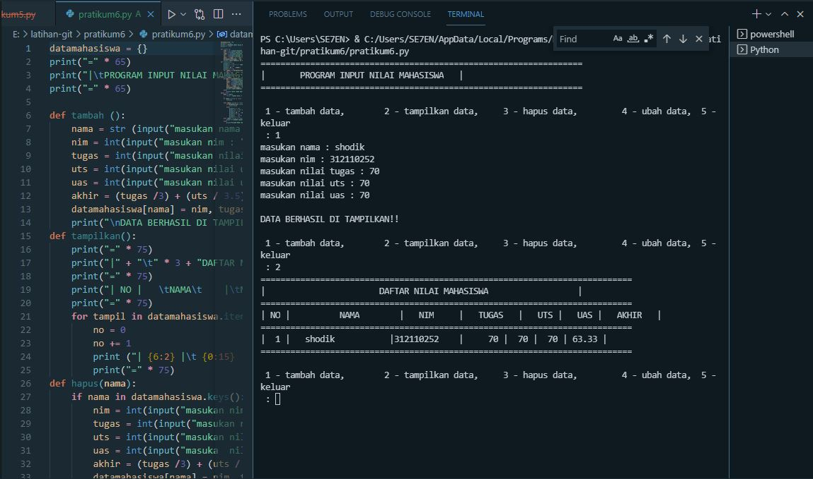

# pratikum6
#PROGRAM INPUT NILAI MAHASISWA MENGGUNAKAN FUNGSI

1. Deklarasi dictionary dengan nama datamahasiswa
2. menggunkan fungsi def tambah
3. meggunakan fungsi def tampilkan
4. menggunakan fungsi def hapus
5. menggunkan  fungsi def ubah
6. menggunakan looping perulangan while true
